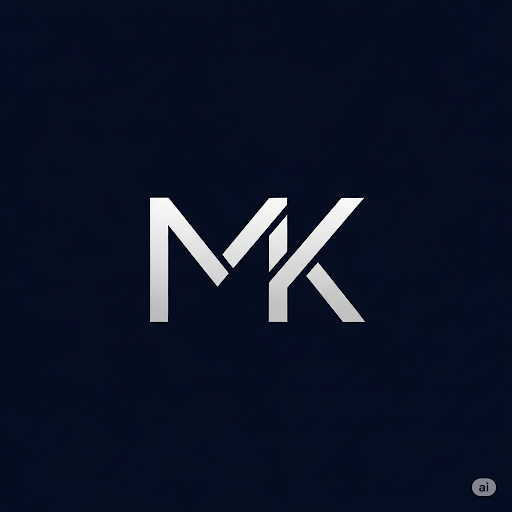

# 🌐 Personal Portfolio Website

A modern, responsive portfolio website showcasing my skills, projects, and professional experience in Cybersecurity and Software Development.


## 👨‍💻 About

Hi! I'm **Manukrishna J P**, a Computer Science student specializing in Cybersecurity at Amrita Vishwa Vidyapeetham. This portfolio website highlights my journey, skills, projects, and achievements in the field of technology and cybersecurity.

## 📁 Project Structure

```
portfolio-website/
│
├── index.html              # Home page with hero section
├── about.html              # About me, education, skills, certifications
├── projects.html           # Portfolio projects showcase
├── contact.html            # Contact form and information
│
├── assets/
│   ├── css/
│   │   ├── index.css       # Styles for home page
│   │   ├── about.css       # Styles for about page
│   │   ├── projects.css    # Styles for projects page
│   │   └── contact.css     # Styles for contact page
│   │
│   ├── js/
│   │   ├── index.js        # JavaScript for home page
│   │   ├── about.js        # JavaScript for about page
│   │   ├── projects.js     # JavaScript for projects page
│   │   └── contact.js      # JavaScript for contact page
│   │
│   ├── images/             # All images and logos
│   │   ├── logo.png
│   │   ├── bg.png
│   │   ├── my_img.png
│   │   ├── skill icons/
│   │   ├── certificates/
│   │   └── social media icons/
│   │
│   └── cv/
│       └── cv.pdf          # Downloadable resume
│
└── README.md               # Project documentation


about.html
162 lines

html


contact.html
95 lines

html


index.html
49 lines

html


projects.html
65 lines

html


about.css
267 lines

css


contact.css
208 lines

css


index.css
449 lines

css


project.css
137 lines

css


about.js
12 lines

js


contact.js
26 lines

js


index.js
67 lines

js


projects.js
11 lines

js

maintain consistancy among all. tell where to put what and place also

3:50 PM
I'll analyze your portfolio website files and provide a comprehensive guide on organizing them properly with consistency improvements.

Check the frontend-design skill for best practices on organizing and improving web projects
Now I'll create a comprehensive organization guide for your portfolio website:


1 step

Copy the guide to outputs directory for user access


Presented file
I've created a comprehensive organization guide for your portfolio website! Here are the key findings:

Critical Issues Found:
File Naming Problems:
project.css should be projects.css (to match projects.html)
pyhton.png has a typo (should be python.png)
bg.png.png has double extension (should be bg.png)
HTML Inconsistencies:
Typo: heigh="60px" instead of height="60" in navbar images
Encoding issues: ’, ©, â€" characters throughout
Wrong image for C++ (using css.png instead of cpp.png)
CSS Issues:
Logo positioning inconsistent (fixed vs absolute)
contact.css has NO responsive media queries
Missing consistent hover effects
Missing Features:
Active page indicator in navigation
Social icon hover effects not in all JS files
Recommended Structure:
portfolio-website/
├── index.html, about.html, projects.html, contact.html
├── assets/
│   ├── css/ (all CSS files)
│   ├── js/ (all JS files)
│   ├── images/ (all images)
│   └── cv/ (CV PDF)
The guide includes detailed instructions for fixing all issues, maintaining consistency, and implementing best practices across all pages!

Portfolio organization guide
Document · MD 
make one readme file for the project

4:02 PM

1 step

Copy README to outputs directory


Presented file
Perfect! I've created a comprehensive README.md file for your portfolio website project. Here's what it includes:

📋 README Contents:
Project Overview - Clear introduction with your name and purpose
Features List - All key features highlighted
Project Structure - Complete file organization
Tech Stack - Technologies and tools used
Color Palette - Design system colors
Pages Overview - Detailed description of each page
Getting Started - Installation and setup instructions (multiple methods)
Responsive Breakpoints - Screen size specifications
Browser Support - Compatible browsers
Configuration Guide - How to customize with your own info
Features Breakdown - Animations, interactivity, accessibility
Known Issues - Issues found that need fixing
Future Enhancements - Roadmap for improvements
Contributing Guidelines - How others can contribute
Contact Information - All your social links
License & Acknowledgments
GitHub badges - Visual stats for your repo
The README is professional, well-structured, and provides everything someone needs to understand, set up, and contribute to your portfolio project!

Readme
Document · MD 


Want to be notified when Claude responds?


Claude is AI and can make mistakes. Please double-check responses.
Readme · MD
Copy

# 🌐 Personal Portfolio Website

A modern, responsive portfolio website showcasing my skills, projects, and professional experience in Cybersecurity and Software Development.



## 👨‍💻 About

Hi! I'm **Manukrishna J P**, a Computer Science student specializing in Cybersecurity at Amrita Vishwa Vidyapeetham. This portfolio website highlights my journey, skills, projects, and achievements in the field of technology and cybersecurity.

## ✨ Features

- **Responsive Design**: Fully responsive across all devices (desktop, tablet, mobile)
- **Modern UI/UX**: Clean, professional interface with smooth animations
- **Interactive Elements**: Hover effects, typewriter animations, and dynamic content
- **Fast Loading**: Optimized assets and efficient code
- **Cross-browser Compatible**: Works seamlessly on all modern browsers
- **Accessible**: Built with accessibility best practices

## 🚀 Live Demo

[View Live Website](#) _(Add your deployed URL here)_

## 📁 Project Structure

```
portfolio-website/
│
├── index.html              # Home page with hero section
├── about.html              # About me, education, skills, certifications
├── projects.html           # Portfolio projects showcase
├── contact.html            # Contact form and information
│
├── assets/
│   ├── css/
│   │   ├── index.css       # Styles for home page
│   │   ├── about.css       # Styles for about page
│   │   ├── projects.css    # Styles for projects page
│   │   └── contact.css     # Styles for contact page
│   │
│   ├── js/
│   │   ├── index.js        # JavaScript for home page
│   │   ├── about.js        # JavaScript for about page
│   │   ├── projects.js     # JavaScript for projects page
│   │   └── contact.js      # JavaScript for contact page
│   │
│   ├── images/             # All images and logos
│   │   ├── logo.png
│   │   ├── bg.png
│   │   ├── my_img.png
│   │   ├── skill icons/
│   │   ├── certificates/
│   │   └── social media icons/
│   │
│   └── cv/
│       └── cv.pdf          # Downloadable resume
│
└── README.md               # Project documentation
```

## 🛠️ Built With

### Core Technologies
- **HTML5** - Structure and content
- **CSS3** - Styling and animations
- **JavaScript (ES6+)** - Interactivity and dynamic features

### Design & Fonts
- **Google Fonts** - Inter & Poppins font families
- **Custom CSS Animations** - Glow effects, transitions, hover states
- **Flexbox & Grid** - Modern layout techniques

### Tools & Libraries
- **Responsive Design** - Mobile-first approach
- **CSS Variables** - Consistent theming
- **Form Validation** - Client-side validation

